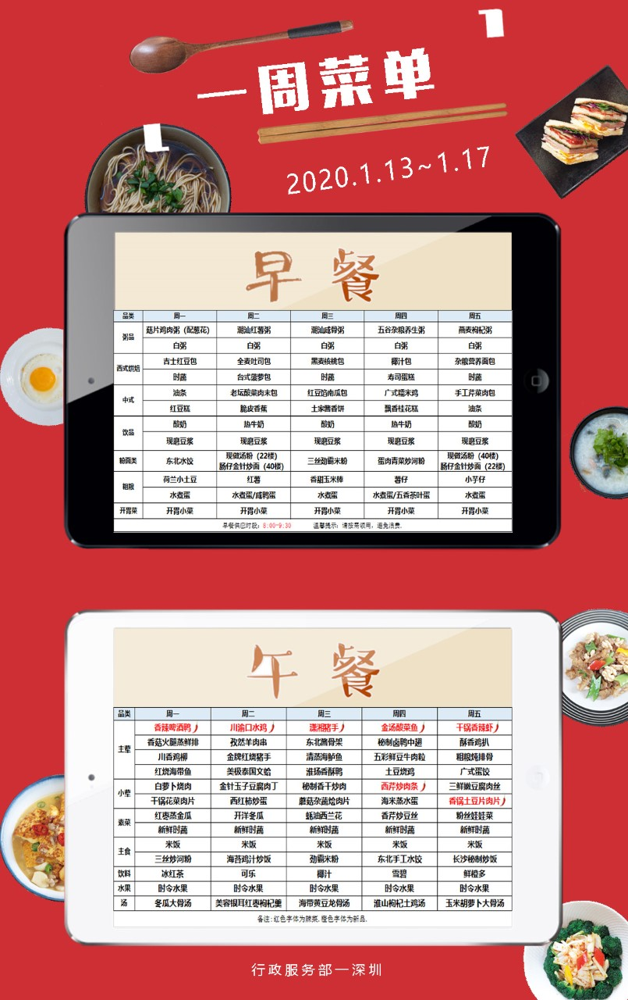

# 商汤科技

## 内推常见问题

**Q：投了简历什么时候会有回复呀？**

A：不好说，短则3-4天，长则3-5周，实习生的话没回复可能是那个岗位招满了。

**Q：待遇如何？加不加班？**

A：校招：薪酬参考offershow；  
实习生：技术岗时薪40起（做得好有绩效）午餐餐补25，房补一天50，晚上8点之后走还有25餐补，公司有健身房，免费的早餐和下午茶零食  
加班情况：不同部门不同岗位情况不同，没办法说的很具体。双休是可以保证的，一般975吧（我们组）。  

**Q：简历会被刷吗？**

A：不知道。但是参考2020年秋招的公众号文章，内推简历同等条件下优先被筛选。

**Q：伙食怎么样？**

A：

**Q：有什么注意事项吗？**

A：简历命名请严格按照要求的格式，不然我怕内推的时候投错岗位了。